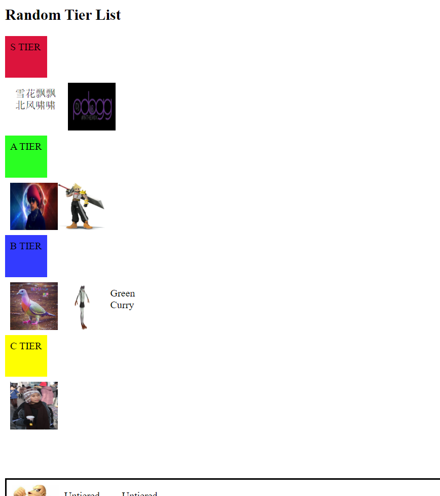
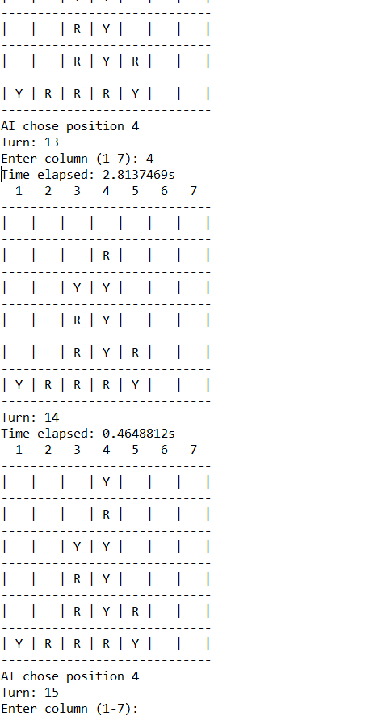

## Benson Liu Portfolio
I am a Junior at NC State, currently pursuing a BS in Computer Science. My area of interest is software engineering.

I have a versatile skill set, through personal projects and coursework. I have gained experience working in numerous languages, including Java, JavaScript, Python, C, CSS, and HTML. I have worked with various tools, such as GitHub, VSCode, Eclipse, Linux, Jenkins, Selenium, and Android Studio.

I am currently looking for an internship, to gain industry experience and contribute in building software.

<a href="url"></a>

### Contact Details
```markdown
Semester Address: 1619 Athens Dr, Raleigh NC 27606
Home Address: 1117 Lakebrink Dr, Morrisville NC 27560
Email: bliunc2000@gmail.com
Phone Number: (919) 592-6068
```

[Resume](Resume.pdf)\
[Cover Letter](CoverLetter.pdf)\
[LinkedIn Profile](https://www.linkedin.com/in/benson-liu-b784641b6/)
<br/>
<br/>
<br/>
<br/>
<br/>
<br/>

### Work Samples
*[TierListMaker](https://github.com/bennysonson/TierListMaker): Simple application for making tier lists, allowing ordering no items in tiers with custom text or images. Written in JavaScript, HTML, and CSS. Uses SortableJS and FileSaver libaries. 
<a href="url"></a>
<a href="url"></a>
<br/>
<br/>
*[BoardGames](https://github.com/bennysonson/Board-Games): Python implementation of various board games with an AI, including Tic Tac Toe and Connect 4. The AI uses the minimax algorithm to play optimal moves.
<br/>
<br/>
*[InstaScript](https://github.com/bennysonson/InstaScript): Application for automating Instagram tasks, with tkinter GUI. Written in Python using Selenium for web tasks. Requires Firefox web browser
<br/>
<br/>
*[TicketManager](https://github.com/bennysonson/TicketManager): Ticket Managing system for an IT department written in Java. Tickets are implemented as an FSM with switch statements.  
